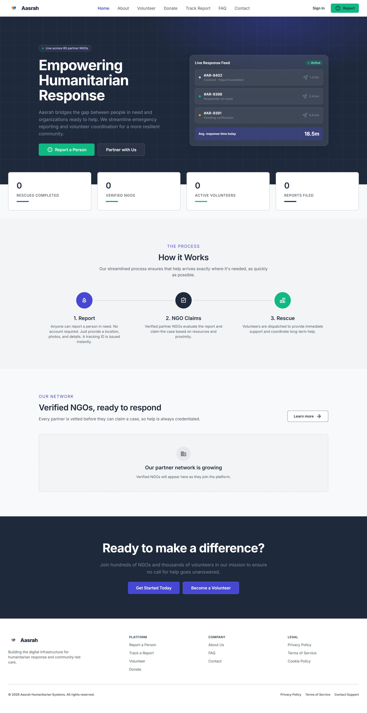
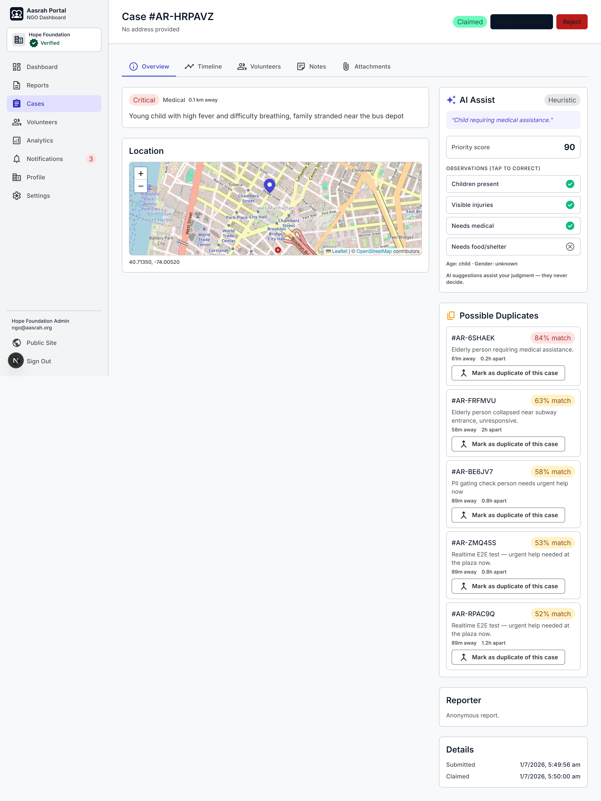
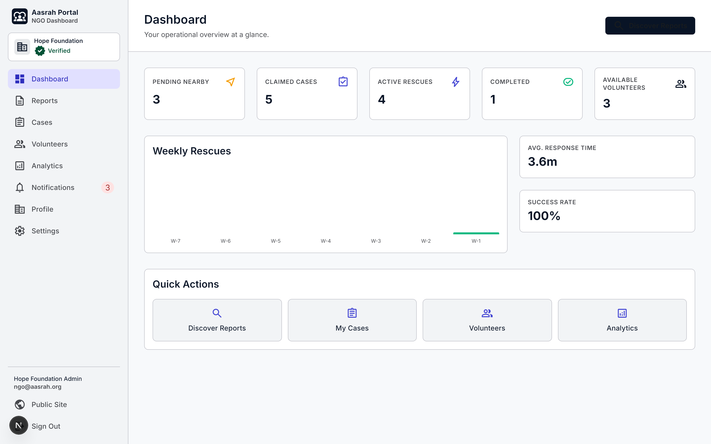
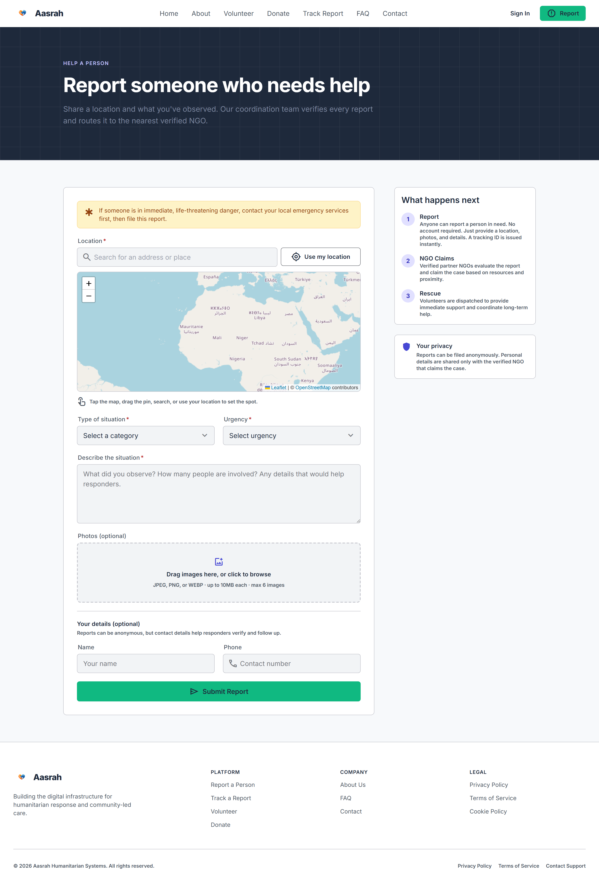
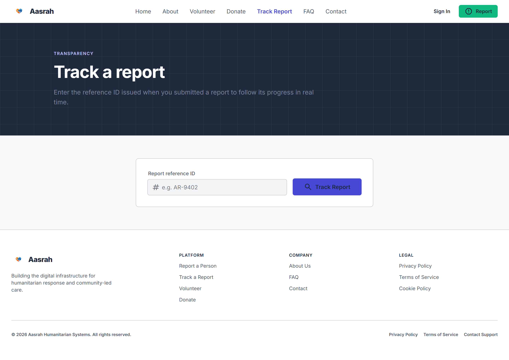
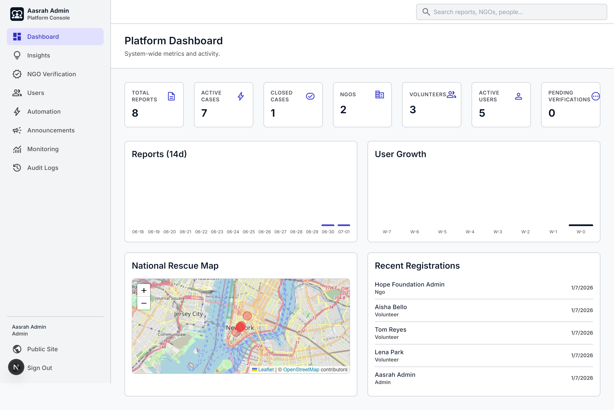
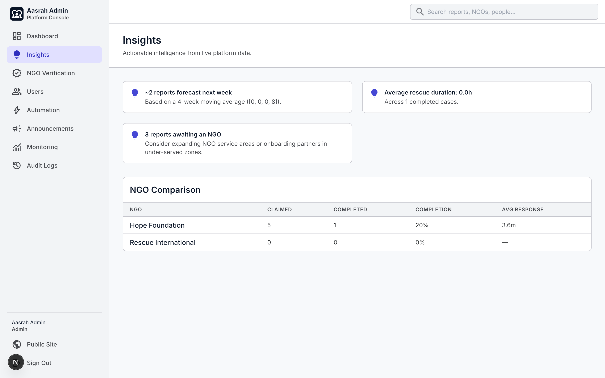
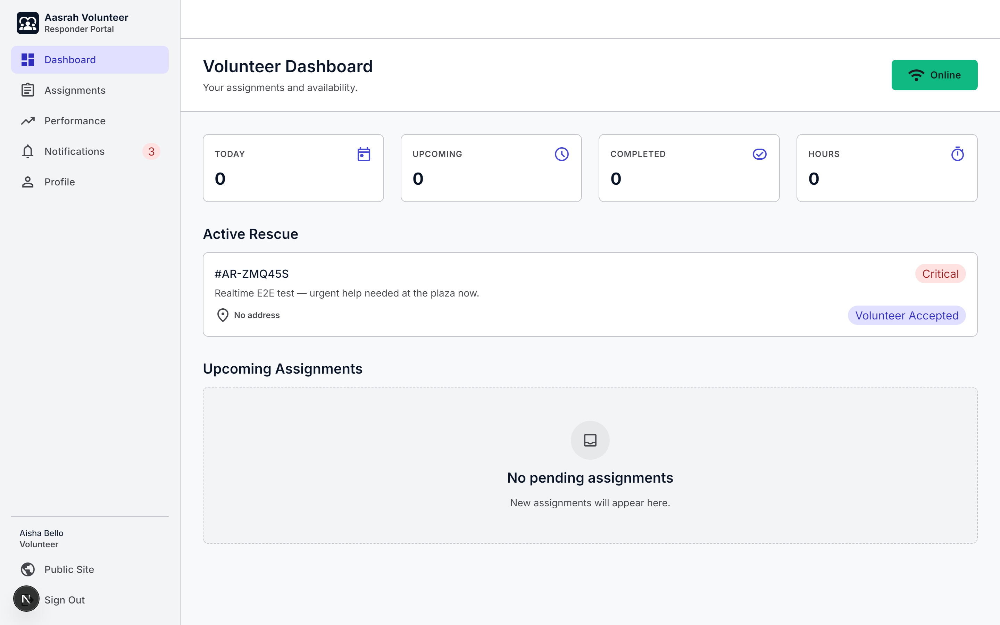
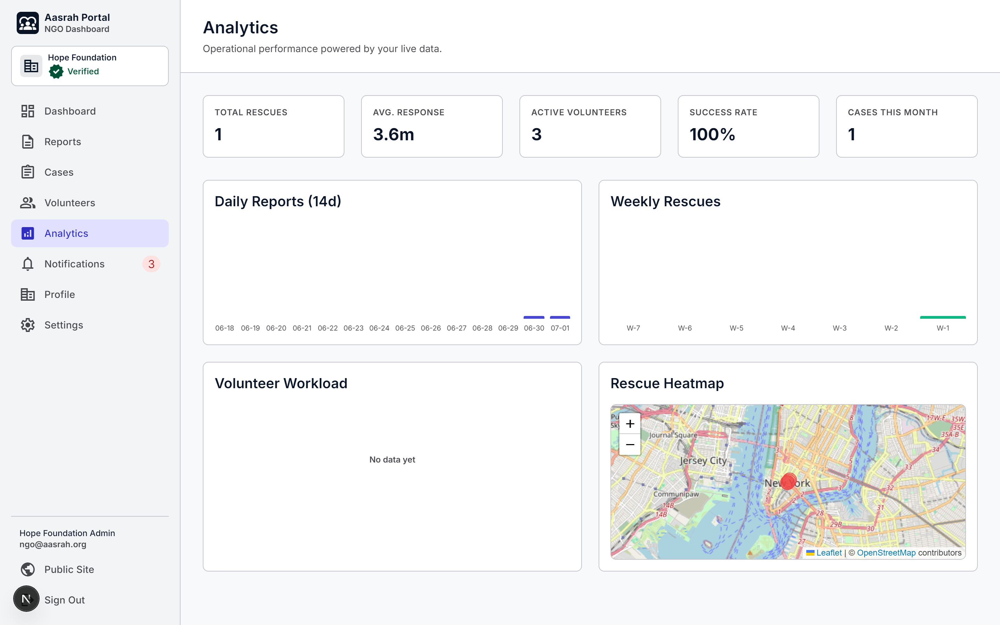
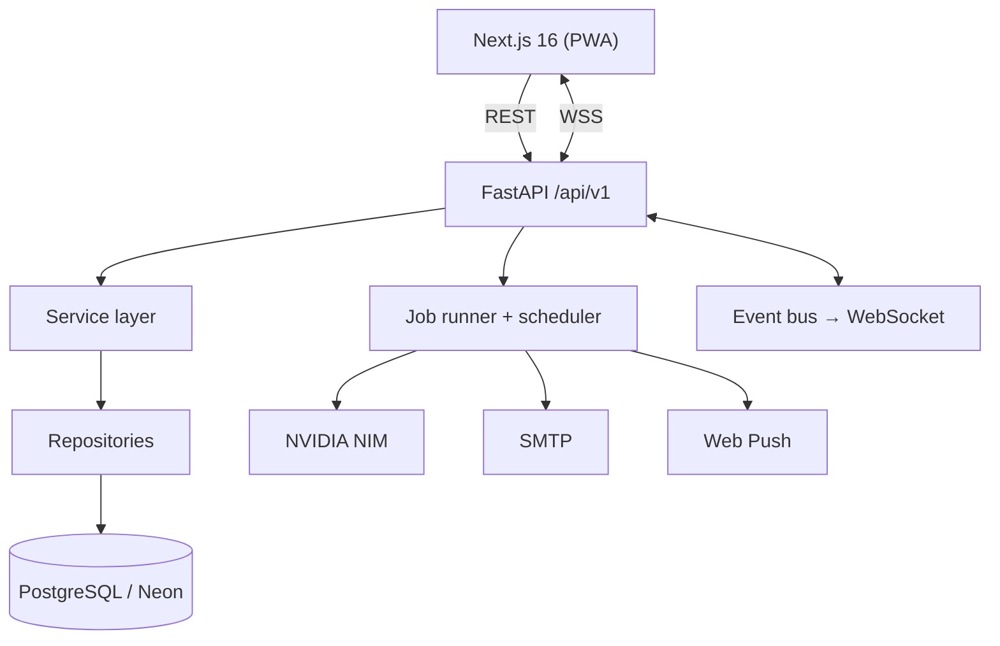

<div align="center">

# 🛟 Aasrah: Humanitarian Response Platform

**An intelligent, real-time coordination platform that connects the public, verified NGOs, volunteers, and administrators, from the first report through to rescue completion.**

Next.js 16 · FastAPI · PostgreSQL · WebSockets · AI-assisted triage · PWA

[Architecture](docs/ARCHITECTURE.md) · [Portfolio write-up](docs/PORTFOLIO.md) · [API docs](#-api) · [Setup](#-quick-start)

</div>



---

## What it is

Aasrah is a full-stack humanitarian response system. Anyone can report a person
who needs help (anonymously, no account required) with photos and a map location; the
platform runs AI-assisted triage, ranks the best-placed NGOs, and coordinates
the rescue lifecycle across NGO staff and field volunteers, with live updates,
audit trails, and analytics throughout. Anyone can track a report's progress
with its ID, no account required.

It was built in five phases and demonstrates modern frontend architecture,
layered backend API design, authentication + RBAC, relational data modeling,
background processing, real-time systems, geospatial workflows, AI integration,
analytics, testing, and production tooling.

## Highlights

- 🔐 **Role-based access, real RBAC**: anonymous public (report + track, no account) · Volunteer · NGO · Admin, each with dependency-enforced authorization. Public registration is **volunteer-only** (pending admin approval); NGO and admin accounts are provisioned administratively, never self-registered.
- 🤖 **AI-assisted triage**: image analysis, one-line report summaries, and natural-language search via NVIDIA NIM (OpenAI-compatible), with a full **heuristic fallback that works with no API key**. Every suggestion is human-overridable.
- 🧠 **Decision support**: dynamic priority scoring, NGO matching (proximity + workload + capacity), volunteer recommendation, and duplicate detection with non-destructive merge.
- ⚡ **Real-time**: authenticated WebSocket delivers notifications, case-status changes, and dashboard refreshes with no polling.
- 🗺️ **Maps & geo**: Leaflet + OpenStreetMap for report location, service-area discovery (haversine), and rescue heatmaps.
- ⚙️ **Automation & jobs**: an in-process background worker pool + a scheduler running configurable rules (escalate unclaimed, close inactive, weekly summaries).
- 📊 **Observability**: request-ID + latency middleware, a `/metrics` endpoint, an admin monitoring dashboard, audit logs, and entity version history.
- 📱 **PWA**: installable, offline app-shell caching, and web-push notifications. (Offline *submission* queuing is not implemented; anything submitted without a connection is not saved.)

## Screenshots

| NGO case detail: AI Assist, duplicates & map | NGO dashboard |
|---|---|
|  |  |

| Report a person | Track a report |
|---|---|
|  |  |

| Admin console | Admin insights |
|---|---|
|  |  |

| Volunteer dashboard | NGO analytics |
|---|---|
|  |  |

<sub>More in [`docs/screenshots/`](docs/screenshots).</sub>

## Features by role

**Anyone (no account)**: submit a report anonymously with multiple images
+ a map-picked location; receive a Report ID on a screenshot-friendly success
screen; follow live rescue-stage progress via Track (sensitive NGO data stays hidden).

**NGO** *(admin-provisioned, verified)*: discover nearby reports (filters, semantic
search), claim cases (locked against double-claim), manage the rescue lifecycle,
assign volunteers (with AI recommendations), keep internal notes + attachments,
review/override AI analysis and priority, and view analytics + a rescue heatmap.

**Volunteer** *(self-register → pending admin approval)*: choose to contribute
as an **Independent** responder (available to any nearby verified NGO) or affiliate
with a **preferred NGO** (editable anytime); once approved, accept/decline
assignments, run the field workflow (on-route → arrived → in-progress → complete)
with a checklist and completion photos, manage availability + profile, and see
performance + recognition badges.

**Admin** *(seed/manual only)*: approve volunteer applications, verify and create
NGO accounts, manage users, broadcast announcements, configure automation rules,
monitor system metrics + jobs, read platform insights, and inspect audit logs +
version history.

## Tech stack

| Layer | Technology |
|-------|-----------|
| Frontend | Next.js 16 (App Router, TypeScript), Tailwind CSS, TanStack Query, Framer Motion, Leaflet, PWA (service worker) |
| Backend | FastAPI, SQLAlchemy 2.0, Alembic, Pydantic v2, slowapi |
| Database | PostgreSQL (Neon): 16 tables, UUID PKs, native enums, indexes/FKs |
| Real-time | WebSockets + in-process pub/sub bus (Redis-swappable) |
| AI | NVIDIA NIM (OpenAI-compatible): vision + text models, heuristic fallback |
| Async | In-process job runner + automation scheduler |
| Notifications | In-app + WebSocket + SMTP email + Web Push (VAPID) |
| Auth | JWT access + rotating refresh tokens, bcrypt, role-based guards |
| Tooling | Docker + docker-compose, GitHub Actions CI, pytest |

## Architecture



Full **HLD/LLD, ER diagram, sequence diagrams, scaling strategy, security model,
and trade-off analysis** live in **[docs/ARCHITECTURE.md](docs/ARCHITECTURE.md)**.
The engineering story (challenges, decisions, and lessons) is in
**[docs/PORTFOLIO.md](docs/PORTFOLIO.md)**. Deploying it (Vercel + EC2, env,
migrations, rollback) is in **[docs/DEPLOYMENT.md](docs/DEPLOYMENT.md)**.

## Quick start

**Prerequisites:** Node.js 22+, Python 3.13+, a PostgreSQL database (a free [Neon](https://neon.tech) project works well).

### Backend
```bash
cd backend
python -m venv .venv && .venv/Scripts/activate   # macOS/Linux: source .venv/bin/activate
pip install -r requirements.txt
cp .env.example .env          # set AASRAH_DATABASE_URL + SECRET_KEY
python -m scripts.init_db     # apply migrations
python -m scripts.seed        # admin user + placeholder NGOs
python -m scripts.seed_phase3 # demo NGO, volunteers, nearby reports (optional)
uvicorn app.main:app --reload # http://localhost:8000  (Swagger at /docs)
```

### Frontend
```bash
cd frontend
npm install
cp .env.local.example .env.local
npm run dev                   # http://localhost:3000
```

### Or the whole stack with Docker
```bash
docker compose up --build     # Postgres + backend + frontend
```

### Demo accounts (after seeding)
| Role | Email | Password |
|------|-------|----------|
| Admin | admin@aasrah.org | ChangeMe123! |
| NGO | ngo@aasrah.org | NgoPass123! |
| Volunteer | vol1@aasrah.org | VolPass123! |

The seeded volunteers are pre-approved (ACTIVE) for demo purposes. A **new**
public registration creates a Volunteer in **pending** status; approve it from
the Admin console (**Users → volunteer approval**) to unlock the volunteer portal.
NGO accounts are created by an admin (there is no public NGO sign-up).

> Rotate all seeded/dev credentials before any public deployment.

### Enabling the optional integrations
The platform runs fully without them; each activates when configured in `backend/.env`:
- **AI (live):** set `NVIDIA_API_KEY` → analysis/summaries/search use NVIDIA NIM instead of the heuristic fallback.
- **Email:** set `SMTP_HOST`/`SMTP_USER`/`SMTP_PASSWORD`.
- **Web push:** run `python -m scripts.gen_vapid`, paste the keys into `backend/.env`, and set `NEXT_PUBLIC_VAPID_PUBLIC_KEY` in the frontend.

## 🔌 API

Versioned under `/api/v1`; interactive docs at `/docs` (Swagger) and `/redoc`.

| Area | Endpoints |
|------|-----------|
| Auth | `register` (volunteer-only), `login`, `refresh`, `logout`, `forgot/reset-password`, `me` |
| Public | `stats` (live platform counts) · `stats/ngos` (verified NGO directory) |
| Reports | create · upload images · `track/{tracking_id}` (all public, no auth) |
| NGO | dashboard · analytics · nearby/claimed · claim · status · case notes/attachments · volunteers · assignments · AI overrides · matching · duplicates · semantic search |
| Volunteer | dashboard · assignments (accept/advance/complete, ACTIVE only) · profile · availability · **assignment-mode** (independent/NGO) · performance |
| Admin | dashboard · **NGO create** + verification · **volunteer approval** · users · announcements · audit logs · monitoring · insights · automation rules |
| Real-time | `WS /ws?token=` |
| Meta | `/health`, `/health/db`, `/metrics` |

## Testing

```bash
cd backend && pytest          # 72 tests: auth, reporting, full rescue lifecycle, admin, access-control regressions, units
```
CI (`.github/workflows/ci.yml`) runs backend lint + tests and frontend lint + build on every push/PR.

## Project structure

```
aasrah/
├── backend/    # FastAPI: api/ services/ repositories/ models/ schemas/ · alembic/ · scripts/ · tests/
├── frontend/   # Next.js: app/ (public, auth, portal, volunteer, admin) · components/ · lib/
└── docs/       # ARCHITECTURE.md · PORTFOLIO.md · screenshots/
```

## License

MIT-licensed portfolio project.

<!-- connectivity check: git + GitHub push verified on 2026-07-18 -->
