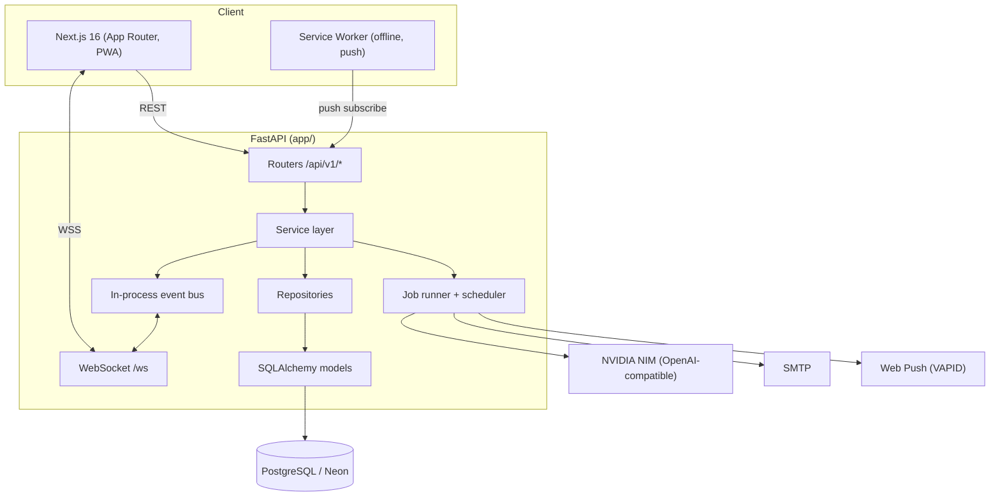
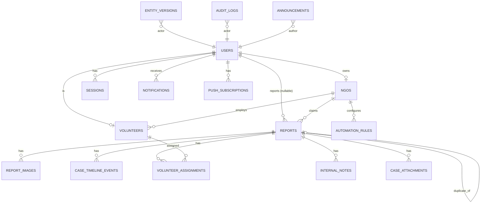
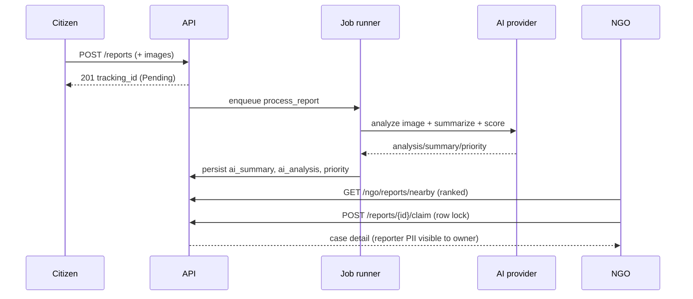
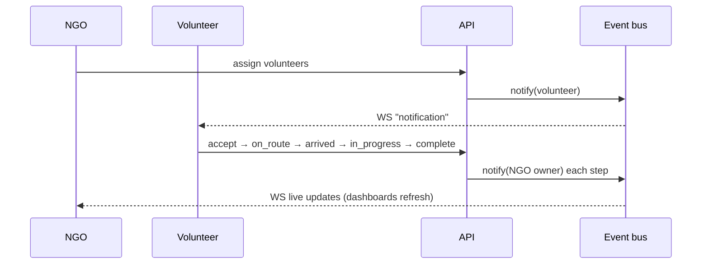

# Aasrah: Architecture (HLD & LLD)

This document describes the architecture of the Aasrah Humanitarian Response
Platform: a full-stack, four-role coordination system with AI-assisted decision
support, real-time updates, background automation, and observability.

- [High-Level Design](#high-level-design)
- [System architecture diagram](#system-architecture-diagram)
- [Low-Level Design](#low-level-design)
- [Database ER diagram](#database-er-diagram)
- [Key sequence diagrams](#key-sequence-diagrams)
- [Deployment architecture](#deployment-architecture)
- [Scaling strategy](#scaling-strategy)
- [Security considerations](#security-considerations)
- [Trade-off analysis](#trade-off-analysis)
- [Future roadmap](#future-roadmap)

---

## High-Level Design

Aasrah connects four roles on one platform:

| Role | Does |
|------|------|
| **Citizen** | Reports a person in need (optionally anonymous); tracks progress by ID. |
| **NGO** | Discovers nearby reports, claims cases, assigns volunteers, manages rescues. |
| **Volunteer** | Accepts assignments and executes the rescue workflow in the field. |
| **Admin** | Verifies NGOs, manages users, broadcasts, monitors, configures automation. |

Cross-cutting capabilities: JWT auth with RBAC, real-time WebSocket events,
AI-assisted analysis/summaries/search (NVIDIA NIM with a heuristic fallback),
priority scoring + NGO/volunteer matching, duplicate detection, a background job
runner + automation scheduler, email + web-push notifications, audit + version
history, and in-process observability.

**Design principles**
- **Layered, testable backend:** routers → services → repositories → ORM.
- **Advisory AI:** every AI output is overridable by humans; nothing auto-decides.
- **Graceful degradation:** AI, email, and push all work (degraded) with no
  external credentials, and upgrade to live providers by setting config.
- **Swap-ready infra:** caching/locks/jobs/pub-sub sit behind interfaces so an
  in-process implementation can become Redis/Celery without touching call sites.

## System architecture diagram



## Low-Level Design

### Backend layering
- **Routers** (`app/api/v1/**`): thin HTTP handlers; auth via dependency guards
  (`get_current_user`, `require_roles`, `get_verified_ngo`, `get_current_volunteer`).
- **Services** (`app/services/**`): business logic: `ngo_reports` (discovery,
  claim with row-lock, status state machine), `vol_service` (assignment workflow),
  `intelligence` (priority scoring, NGO/volunteer matching), `dedup`,
  `semantic_search`, `automation`, `insights`, `report_ai`, `versioning`,
  `ai/` (provider + heuristic fallback), `email/`, `webpush`, `jobs`, `realtime`.
- **Repositories** (`app/repositories/**`): data access; `BaseRepository.get`
  coerces string IDs → UUID for backend portability.
- **Models** (`app/models/**`): 16 tables; UUID PKs (server default +
  Python default), portable `JSONType` (JSONB on PG, JSON elsewhere).

### Patterns demonstrated
Clean layering · repository pattern · dependency injection (FastAPI `Depends`) ·
background workers · WebSockets · distributed-lock-style row locking on claims ·
provider abstraction with fallback · centralized config (`pydantic-settings`) ·
structured logging + metrics · CI/CD · containerized deployment.

### Rescue lifecycle state machine
```
pending → claimed → volunteer_assigned → volunteer_accepted → on_route →
reached_location → rescue_completed → shelter_assigned → closed
                                         (+ verified / rejected branches)
```
Transitions validate permission + legality, append a timeline event, write an
audit log, snapshot a version, and emit a notification (in-app + WS + push).

## Database ER diagram



Tables: `users, sessions, reports, report_images, case_timeline_events,
volunteer_assignments, internal_notes, case_attachments, ngos, volunteers,
notifications, announcements, audit_logs, automation_rules, entity_versions,
push_subscriptions`.

## Key sequence diagrams

### Citizen report → AI processing → NGO claim


### Volunteer rescue + real-time notification


## Deployment architecture

- **Frontend:** `frontend/Dockerfile`, Next.js standalone output; `NEXT_PUBLIC_*`
  baked at build via `--build-arg`.
- **Backend:** `backend/Dockerfile`, uvicorn; health at `/api/v1/health`,
  metrics at `/metrics`. Run `scripts/init_db` on release.
- **Full stack:** root `docker-compose.yml` (Postgres + backend + frontend).
- **CI:** `.github/workflows/ci.yml`, backend lint+tests, frontend lint+build.

```mermaid
graph LR
  U[Users] --> CDN[Frontend container / CDN]
  U --> LB[Reverse proxy]
  LB --> BE[Backend container(s)]
  BE --> PG[(Neon Postgres)]
  BE -. optional .-> REDIS[(Redis: cache/locks/queue)]
  BE --> NIM[NVIDIA NIM]
```

## Scaling strategy

| Concern | Now (single process) | At scale |
|---------|----------------------|----------|
| Real-time bus | in-process asyncio queues | Redis pub/sub fan-out across replicas |
| Background jobs | in-process worker pool | Celery/RQ workers on a broker |
| Claim contention | Postgres `SELECT … FOR UPDATE` | same (DB is the lock authority) |
| Caching | none (per decision) | Redis for dashboards/analytics with event-based invalidation |
| Discovery geo-query | bounding-box prefilter + haversine | PostGIS `GEOGRAPHY` + GiST index |
| AI inference | synchronous NIM call in a job | dedicated inference queue + batching |
| Media | local disk (`StorageBackend`) | S3/R2/Cloudinary adapter |

Stateless API replicas scale horizontally behind a load balancer; sticky
sessions are unnecessary because WS auth is token-based and the bus becomes Redis.

## Security considerations

- **AuthN/Z:** JWT access + rotating refresh tokens (revocable via `sessions`);
  RBAC dependency guards; WebSocket connects require a valid access token **and**
  an active account (parity with HTTP).
- **Data exposure:** reporter PII is exposed only to the claiming NGO; unclaimed
  case detail is service-area-scoped and PII-redacted.
- **Uploads:** magic-byte sniffing (not client content-type), server-derived
  extension, bounded chunked reads (memory-DoS guard), image re-encode.
- **Transport/headers:** CORS allowlist, security headers middleware
  (`nosniff`, `X-Frame-Options`, Referrer-Policy, HSTS in prod).
- **Abuse:** slowapi rate limiting (stricter on auth); input sanitization on
  free-text; append-only audit log + entity version history for accountability.
- **Secrets:** env-based config; nothing committed; rotate before deploy.

## Trade-off analysis

- **In-process bus/jobs vs Redis/Celery:** chose in-process for zero-infra
  simplicity and a clean interface; documented the swap. Cost: single-process
  fan-out and no cross-replica delivery until Redis is added.
- **Heuristic AI fallback vs hard dependency:** the platform is fully functional
  offline; AI is an enhancement, not a hard requirement. Cost: heuristic quality
  is lower than the LLM until a key is set.
- **SQLite-in-tests vs Postgres-in-tests:** fast, hermetic tests; required making
  models backend-portable (UUID/JSON variants). A couple of PG-specific behaviors
  (row-lock semantics) are verified via live E2E instead of unit tests.
- **Two AI models (vision + text) vs one:** the omni model could do both, but a
  dedicated high-reliability text model improves summaries/query-parsing; cost is
  two model IDs to manage.

## Future roadmap

1. Redis: pub/sub for multi-replica real-time, distributed locks, response cache.
2. PostGIS for accurate geo queries + rescue heatmap tiles.
3. Vector embeddings for semantic search + smarter duplicate detection.
4. Cloud object storage adapter + CDN for media.
5. Celery/RQ workers with a dashboard; scheduled analytics snapshots.
6. Mobile app (React Native) reusing the same API + WS + push.
7. Multi-tenant / multi-region support and per-region data residency.
